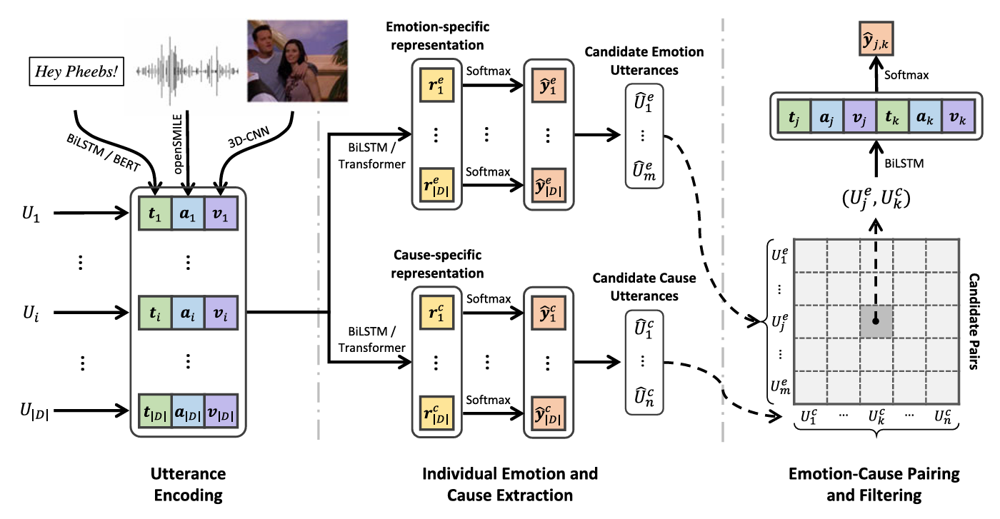

# Multimodal Emotion-Cause Pair Extraction in Conversations

This repository contains the working code for the paper: [Multimodal Emotion-Cause Pair Extraction in Conversations](https://arxiv.org/pdf/2110.08020). The implementation is part of **Team NVDL**'s submission for the course **CS550: Machine Learning**.

---

## 1. Introduction

The project addresses the novel task of **Multimodal Emotion-Cause Pair Extraction in Conversations (MECPE)**, aiming to identify emotions and their corresponding causes across multimodal data—text, audio, and video.

Traditional research primarily focused on emotion recognition or textual emotion cause analysis, neglecting the inherent multimodal nature of conversations. The MECPE task bridges this gap by jointly extracting emotion-cause pairs in a multimodal context.

This implementation uses the **Emotion-Cause-in-Friends (ECF)** dataset, constructed from the *Friends* sitcom, containing 13,619 utterances and 9,794 annotated emotion-cause pairs across three modalities.

### Previous Work
- **Emotion Recognition in Conversations (ERC):** Recognizes emotions in textual or multimodal settings.
- **Emotion-Cause Pair Extraction (ECPE):** Jointly identifies textual emotions and their causes without leveraging multimodal features.

Our project builds on these foundations by introducing multimodal interactions, including text, audio, and video features.

---

## 2. Methodology

The MECPE task employs a deep learning pipeline, comprising feature extraction and pair prediction, guided by the architecture below:

**Model Architecture**  

Key components:
1. **Feature Extraction**: Extracts representations from text (BERT/Glove), audio (OpenSMILE), and video (3D-CNN).
2. **Emotion-Cause Prediction**: Multi-task learning detects emotions and causes separately before pairing them.
3. **Pair Construction**: Uses Cartesian product and distance embeddings to evaluate causal relationships.

---

## 3. Procedure

### 3.1 Feature Extraction
- **Text**: Represented using BERT embeddings for semantic richness or GloVe embeddings for lightweight modeling.
- **Audio**: Acoustic features extracted using OpenSMILE toolkit based on the INTERSPEECH 2009 challenge set.
- **Video**: Spatio-temporal features captured through 3D-CNN networks (C3D).

### 3.2 Emotion and Cause Detection
- Two separate BiLSTM encoders identify utterances with emotions and their potential causes.
- Cross-entropy loss optimizes detection for both tasks.

### 3.3 Emotion-Cause Pair Construction
- Emotion and cause sets are paired through:
  - Cartesian product of detected utterances.
  - Concatenated multimodal feature vectors (emotion utterance, cause utterance, and distance vector).
- A softmax layer classifies valid emotion-cause pairs.

### File Overview (Template Section)
#### Feature Extraction :
-Audio
| **File Name**        | **Description**                              |
|-----------------------|----------------------------------------------|
| `audio_embs.ipynb` | For Visualization of the Features Extracted. |
| `extract_audio_fe.py`           | Implementation of the Audio Feature Extraction using OpenSmile.    |
<!-- | `train.py`           | Contains the training loop and evaluation metrics. | -->

-Text
| **File Name**        | **Description**                              |
|-----------------------|----------------------------------------------|
| `glove_vector.ipynb` | For Visualization of the Features Extracted. |
| `extract_text_fe.py`           | Implementation of the Text Feature Extraction using Glove.    |
| `ECF_glove_300.txt` | Already Extracted glove text embeddings |
<!-- | `train.py`           | Contains the training loop and evaluation metrics. | -->

-Video
| **File Name**        | **Description**                              |
|-----------------------|----------------------------------------------|
| `video_vectors.ipynb` | For Visualization of the Features Extracted. |
| `C3D.py` | Defining the 3D CNN model to be used |
| `extract_video_fe.py`           | Implementation of the Video Feature Extraction using 3DCNN.    |
<!-- | `train.py`           | Contains the training loop and evaluation metrics. | -->

#### Model :
| **File Name**        | **Description**                              |
|-----------------------|----------------------------------------------|
| `helper.py` | Functions Defined which will be used for training |
| `pair.py`           | Extracction of the emotion cause pairs    |
| `BiLSTM_EC.py`           | Emotion & Cause utterances extractions using separate BiLSTMs |

<!-- *(Add more rows as needed.)* -->

---

## 4. Results

Experimental evaluations demonstrate the effectiveness of the MECPE model using multimodal features. Key observations:
- Introducing audio and video features significantly improves recall.
<!-- - The BERT-based model outperforms LSTM on text-only settings but gains marginal improvements with additional modalities. -->

For detailed results, refer to the *Results Section* in the project report.

---

## 5. Contributions

- **Team Members**: Team NVDL  
- **Contributions**:  
  - **[Naga Jaswanth]**: Model architecture and implementation.  
  - **[Sai Surya]**: Deployment and Video Feature Extraction.  
  - **[Munjam Navadeep]**: 3D CNN Architecture and  Video Feature Extraction.  
  - **[Siri]**: Text Feature Extraction and Helper Functions.  
  - **[Veda Sri]**: Text Feature Extraction and Helper Functions.
---
